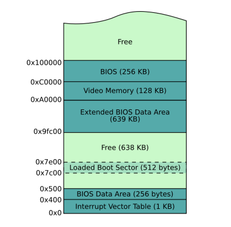

# tinyos - a LEGACY OS written from scractch
This is my end of year project for my M1. It is now archived, but you will find everything needed to continue the project here.

## Current State
- [x] The bootloader is setting everything up, switching to [protected mode](https://wiki.osdev.org/Protected_Mode) and then loads the kernel. The bootloader is a "legacy" type, which means it is written in assembly and is not benefiting from UEFI standards. It is withing that bootloader that we setup the [GDT](https://wiki.osdev.org/Global_Descriptor_Table).
- [x] The bootloader then reads the disk and loads the kernel.
- [x] The kernel is successfully loaded, and the [IDT](https://wiki.osdev.org/Interrupt_Descriptor_Table) and [ISR](https://wiki.osdev.org/Interrupts) are setted up. This allows to create time based events with [timers](kernel/timer.h) and handle [keyboard inputs](drivers/keyboard.h).
- [x] You can allocate dynamic memory using the functions in the [memory.h](libs/memory.h). However, you cannot free and realloc memory at the time. Only a standard flat memory allocation has been written.
- [x] Multiple functions from the standard library have been rewritten to be used. They are located under the [utils.h](libs/utils.h), [string.h](libs/strings.h) and [random.h](libs/random.h).
- [x] ATA Drivers are written. That means that the kernel is able to read and write to the disk. The functions are located inside [ata.h](drivers/ata.h). 

## What could be added
- [ ] Rewrite the [linker](./linker.ld) and the [Makefile](./Makefile) to implement a two stage loader. It means that the bootloader loads a smaller kernel, that will then load and map in memory the full kernel. We should do that to bypass the size limit that is currently limiting the possibilities. Words aren't explaining really well the problem so see the image underneath.

  

- [ ] Implement a paged memory manager, or at least a way to free and realloc the memory. Testing to implement the [liballoc](https://github.com/blanham/liballoc) project can be found under [newLib/memory.c](newLib/memory.c).
- [ ] Implement the [FAT Filesystem](https://wiki.osdev.org/FAT), allowing the user to read and write files.
- [ ] Create some forms of application, to make it useable.

## How To compile
In order to compile this project, you will need a cross compiler. The executables should be preceded `i386-elf-` (like `i386-elf-gcc` for example). You can find how to create your cross compiler on [this osDev page](https://wiki.osdev.org/GCC_Cross-Compiler) or on [this github page](https://github.com/cfenollosa/os-tutorial/tree/master/11-kernel-crosscompiler). It will be easier to do it on Linux.

Once you have your cross compiler ready, you'll just have to run `make run` to compile & launch the OS within QEMU. Other make commands such as `make clean` and `make debug` are also included.

## Code documentation & Standards
Every single function inside the code has been documented using the [doxygen](https://www.doxygen.nl/index.html) standards. You should be able to understand everything thanks to that, and the comments inside the code and the wiki.

You can find the generated doxygen html under the [doc/index.html](doc/index.html) file.

The code has been indented using my personnal standards (sorry), to make it more readeable.

## Ressources
- [osDevWiki](https://wiki.osdev.org/)
